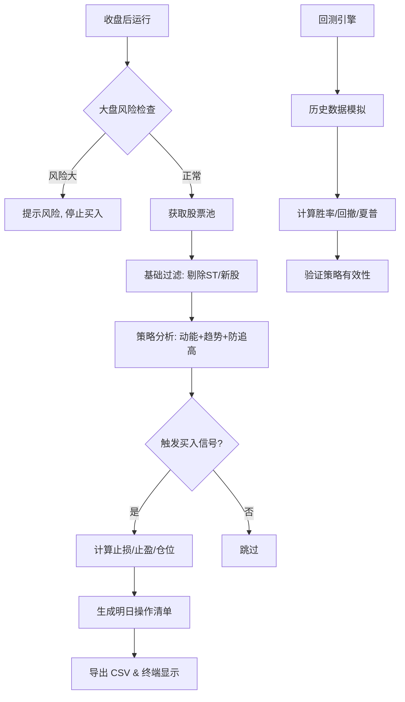

# A股量化交易决策辅助工具 - 量化方案说明

本方案旨在通过量化手段，在收盘后自动筛选符合“动能+趋势”特征的股票，并生成次日操作计划，帮助投资者规避情绪化交易。

---

## 1. 核心逻辑架构

方案采用模块化设计，确保数据获取、选股过滤、策略计算与计划生成各司其职。

---

## 2. 详细方案设计

### 2.1 选股范围 (Stock Pool)
- **全A股筛选**：默认遍历全市场 5000+ 只股票。
- **硬性过滤**：
    - **剔除 ST/退市股**：规避退市风险及极端的非理性波动。
    - **剔除新股**：要求上市满 1 年，确保有足够的历史数据进行均线计算。
- **自定义支持**：支持通过 `data/myshare.txt` 导入用户个人关注的精选池。

### 2.2 量化策略 (Strategy)
采用经典的**趋势跟随**与**成交量验证**相结合的策略。

#### A. 买入条件 (Entry)
1. **趋势确认**：当日收盘价 > 20日移动平均线 (MA20)。
    - *逻辑：确保股价处于短期上升趋势中。*
2. **动能爆发**：当日成交量 > 前一日成交量 × 1.2。
    - *逻辑：量增价升，确认资金流入，提高突破的真实性。*
3. **防追高过滤**：当日收盘价 <= MA20 × 1.03。
    - *逻辑：防止股价在突破当日涨幅过大，远离均线导致回撤风险增加。*

#### B. 止损逻辑 (Exit - Stop Loss)
采用“固定比例”与“技术指标”双重保护，取二者中**较高价**（即最先触发的价位）：
- **固定止损**：买入价 - 5%。
- **均线止损**：跌破 20日均线 (MA20)。

#### C. 止盈逻辑 (Exit - Take Profit)
- **固定止盈**：目标收益率设定为 15%。
- **移动止盈**：当股价从持仓期间最高点回落 8% 时触发止盈。
    - *逻辑：在趋势行情中“让利润奔跑”，同时在趋势反转时及时锁定利润。*

### 2.3 风险控制 (Risk Management)
- **系统性风险监控**：以沪深 300 指数作为大盘风向标。
- **熔断机制**：若沪深 300 指数跌破 60日均线 (MA60)，系统判定为“环境风险大”，将强制停止所有买入建议，仅提示处理现有持仓的止损。

---

## 3. 交易计划生成 (Plan Generator)

系统输出的“明日操作清单”直接对接券商 App 的**条件单**功能：

| 字段 | 对应券商 App 操作 |
| :--- | :--- |
| **建议买入价** | 设定为条件单的“价格触发”参考 |
| **止损触发价** | 设定为“价格跌破”条件单 |
| **止盈触发价** | 设定为“价格涨破”条件单 |
| **建议仓位** | 按照总资金 10% 自动换算为股数 |

---

## 4. 方案优势
1. **客观性**：完全基于数据和预设逻辑，消除盘中波动对心理的影响。
2. **可执行性**：输出结果直接对应条件单参数，实现“收盘分析，次日挂单”。
3. **安全性**：内置大盘过滤机制，在弱势行情中自动空仓避险。

---

> [!IMPORTANT]
> **风险提示**：量化方案基于历史数据回测和逻辑推导，不保证未来收益。实际操作中请务必考虑滑点、佣金及市场极端情况。
